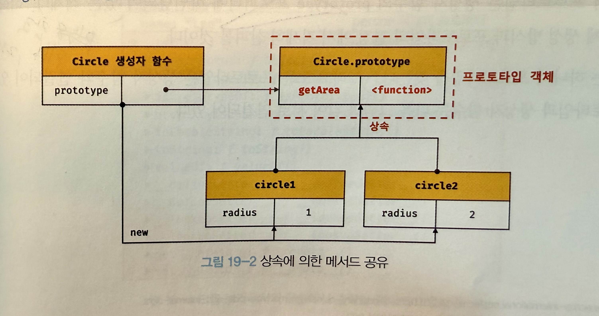
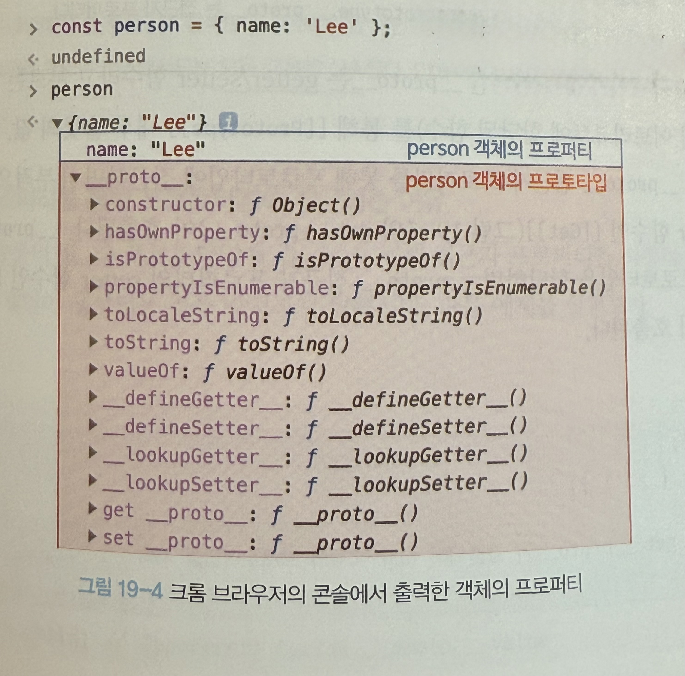

## 객체지향 프로그래밍

- 객체의 집합으로 프로그램을 표현하려는 프로그래밍 패러다임을 객체지향 프로그래밍이라고 한다.
- 다양한 속성 중에서 프로그램에 필요한 속성만 간추려 내어 표현하는 것을 `추상화`라고 한다.
- 객체지향 프로그래밍은 객체의 상태를 나타내는 데이터와 상태를 조작할 수 있는 동작을 하나로 묶어 생각한다. 따라서 객체는 `상태 데이터와 동작을 하나의 논리적인 단위로 묶은 복합적인 자료구조`라고 할 수 있다.
- 이때 객체의 상태 데이터를 `프로퍼티`, 동작을 `메서드`라고 부른다.

## 상속과 프로토타입

- `상속`은 객체지향 프로그래밍의 핵심 개념으로, 어떤 객체의 프로퍼티 또는 메서드를 다른 객체가 상속받아 그대로 사용할 수 있는 것을 말한다.
- **자바스크립트는 프로토타입을 기반으로 상속을 구현한다.**

```
// 생성자 함수
function Circle(radius) {
  this.radius = radius;
}

// Circle 생성자 함수가 생성한 모든 인스턴스가 getArea 메서드를 공유할 수 있도록 프로토타입에 추가한다.
// 프로토타입은 Circle 생성자 함수의 prototype 프로퍼티에 바인딩되어 있다.
Circle.prototype.getArea = function () {
  return Math.PI * this.radius ** 2;
};

// 인스턴스 생성
const circle1 = new Circle(1);
const circle2 = new Circle(2);

// Circle 생성자 함수가 생성한 모든 인스턴스는 부모 객체 역할을 하는
// 프로토타입 Circle.prototype으로부터 getArea 메서드를 상속받는다.
// 즉, Circle 생성자 함수가 생성하는 모든 인스턴스는 하나의 getArea 메서드를 공유한다.
console.log(circle1.getArea === circle2.getArea); // true

console.log(circle1.getArea()); // 3.141592653589793
console.log(circle2.getArea()); // 12.566370614359172

```



## 프로토타입 객체

- 프로토타입 객체란 객체지향 프로그래밍의 근간을 이루는 `객체 간 상속`을 구현하기 위해 사용된다.
- 프로토타입은 어떤 객체의 상위 객체의 역할을 하는 객체로서 다른 객체에 공유 프로퍼티(메서드 포함)를 제공한다.
- 프로토타입을 상속받은 하위 객체는 상위 객체의 프로퍼티를 자신의 프로퍼티처럼 자유롭게 사용할 수 있다.
- 모든 객체는 [[Prototype]]이라는 내부 슬롯을 가지며, 이 내부 슬롯의 값은 프로토타입의 참조다.
- [[Prototype]]에 저장되는 프로토타입은 객체 생성 방식에 따라 결정된다. 객체 리터럴에 의해 생성된 객체의 프로로타입은 Object.prototype이고 생성자 함수에 의해 생성된 프로로타입은 생성자 함수의 prototype 프로퍼티에 바인딩되어 있는 객체다. (위 예시에 getArea가 예시)
- 모든 객체는 하나의 프로토타입을 가지며 모든 프로토타입은 생성자 함수와 연결되어 있다.

### ` __proto__` 접근자 프로퍼티

- 모든 객체는 `__proto__` 접근자 프로퍼티를 통해 자신의 프로토타입, 즉 [[Prototype]] 내부 슬롯에 접근할 수 있다.



#### `__proto__`는 접근자 프로퍼티다.

- 원칙적으로 내부 슬롯은 프로퍼티가 아니므로 내부 슬롯과 내부 메서드에 직접적으로 호출할 수 있는 방법을 제공하지 않는다.
- 내부 슬롯([[Prototype]], [[Get]], [[Set]] 같은 것들)은 자바스크립트 엔진 내부적으로만 사용되고, 우리가 코드에서 직접 object.[[Prototype]] 이런 식으로 접근할 수 없다는 뜻이다.
- 단, 일부 슬롯과 내부 메서드에 한하여 간접적으로 접근할 수 있는 수단이 `__proto__` 이다.
- `__proto__` 접근자 프로퍼티를 통해 프로토타입에 접근하면 getter 함수인 [[Get]]이, 새로운 프로토타입을 할당하면 setter 함수인 [[Set]]이 호출된다.

  ```
  const obj = { a: 1 };
  console.log(obj.__proto__); // Object.prototype을 출력
  // getter 함수([[Get]])를 가지고 있어서 가능

  const newProto = { b: 2 };
  obj.__proto__ = newProto;  // obj에 새로운 프로로타입을 할당
  console.log(obj.b);        // 2 (setter 함수 [[Setter]] 덕분에 obj가 newProto를 상속받았기 때문)

  ```

#### `__proto__` 접근자 프로퍼티는 상속을 통해 사용된다.

- `__proto__` 접근자 프로퍼티는 객체가 직접 소유하는 프로퍼티가 아니라 Object.prototype 의 프로퍼티다.
- 모든 객체는 상속을 통해 `Object.prototype.__proto__ ` 접근자 프로퍼티를 사용할 수 있다.
- object.prototype은 프로토타입 체인의 최상위 객체이며 이 객체의 프로퍼티와 메서드는 모든 객체에 상속된다.

#### `__proto__` 접근자 프로퍼티를 통해 프로로타입에 접근하는 이유

- 프로토타입 체인은 단방향 링크드로 구성되어야 순환 참조 오류가 나지 않기 때문에, 아무런 체크 없이 프로토타입을 교체시키지 않기 위해 사용한다.

#### `__proto__` 접근자 프로퍼티를 코드 내에서 직접 사용하는 것은 권장하지 않는다.

- `__proto__`는 원래 표준이 아니라 비표준 방식이었고, 모든 객체가 `__proto__`를 사용할 수 있는 것도 아니다.
- 때문에 Object.getPrototypeOf(obj)나 Object.setPrototypeOf(obj, newProto) 같은 공식 메서드를 쓰는 것이 좋다.

### 함수 객체의 Prototype 프로퍼티

- 함수 객체만이 소유하는 prototype 프로퍼티는 생성자 함수가 생성할 인스턴스의 프로토타입을 가리킨다.
- prototype 프로퍼티는 생성자 함수가 생성할 객체(인스턴스)의 프로토타입을 가리킨다. 따라서 생성자 함수로서 호출할 수 없는 함수, 즉 Non-constructor인 화살표 함수와 ES6 메서드 축약 표현으로 정의한 메서드는 Prorotype 프로퍼티를 소유하지 않으며 프로토타입도 생성하지 않는다.

```
function Person(name) {
  this.name = name;
}

console.log(Person.hasOwnProperty('prototype')); // true
// prototype 프로퍼티에는 constructor 프로퍼티가 포함되며, 이 constructor는 원래의 Person 함수를 가리킴.
console.log(Person.prototype); // { constructor: Person }

```

- `__proto__`와 `prototype`은 결국 같은 프로토타입을 가리킨다. "누가 누구의 프로토타입을 가리키는지" 이해하는 게 중요하다.

```
function Person(name) {
  this.name = name;
}

const me = new Person('Lee');

// prototype은 생성자 함수의 속성 -> Person.prototype
// __proto__는 인스턴스의 속성 -> me.__proto__
console.log(Person.prototype === me.__proto__); // true
```

### 프로토타입의 constructor 프로퍼티와 생성자 함수

- 모든 프로토타입은 constructor 프로퍼티를 갖는다. 이 constructor 프로퍼티는 prototype 프로퍼티로 자신을 참조하고 있는 생성자 함수를 가리킨다.

```
// 생성자 함수
function Person(name){
    this.name = name;
}
const me = new Person('Lee')
// me 객체의 생성자 함수는 Person이다
console.log(me.constructor === Person); // true
```

## 리터럴 표기법에 의해 생성된 객체의 생성자 함수와 프로토타입

- 리터럴 표기법은 인스턴스를 생성하지 않는 객체 생성 방식이다.

  ```
  // 객체 리터럴
  const obj = {}

  // 함수 리터럴
  const add = function(a,b){return a+b}

  // 배열 리터럴
  const arr = [1,2,3]
  ```

- Object 생성자 함수와 객체 리터럴이 내부적으로 같은 방식으로 객체를 생성한다

  ```
  const obj1 = {}; // 객체 리터럴
  const obj2 = new Object(); // Object 생성자 함수 사용

  console.log(obj1.__proto__ === obj2.__proto__); // true
  ```

- {}(객체 리터럴)와 new Object()은 객체를 만드는 방식은 다르지만, 결과적으로 같은 프로토타입을 공유하는 객체가 생성된다.
- 객체 리터럴에 의해 생성된 객체는 Object 생성자 함수가 생성한 객체가 아니다.
- 객체 리터럴로 생성된 객체는 constructor 프로퍼티를 통해 Object 생성자 함수와 연결된다.
  ```
  const obj = {};
  console.log(obj.constructor === Object); // true
  ```
- 일반 함수와 생성자 함수도 위와 마찬가지로 둘 다 constructor 프로퍼티를 가진다.
  ```
  function foo(){}
  // foo의 생성자 함수는 Function 생성자 함수다.
  console.log(foo.constructor === Function)
  ```
- 다시 말해, 프로토타입과 생성자 함수는 단독으로 존재할 수 없고 언제나 쌍으로 존재한다.
- 리터럴 표기법에 의해 생성된 객체의 생성자 함수와 프로토타입은 다음과 같다.

| 리터럴 표기법      | 생성자 함수 | 프로토타입         |
| ------------------ | ----------- | ------------------ |
| 객체 리터럴        | Object      | Object.prototype   |
| 함수 리터럴        | Function    | Function.prototype |
| 배열 리터럴        | Array       | Array.prototype    |
| 정규 표현식 리터럴 | RegExp      | RegExp.prototype   |
