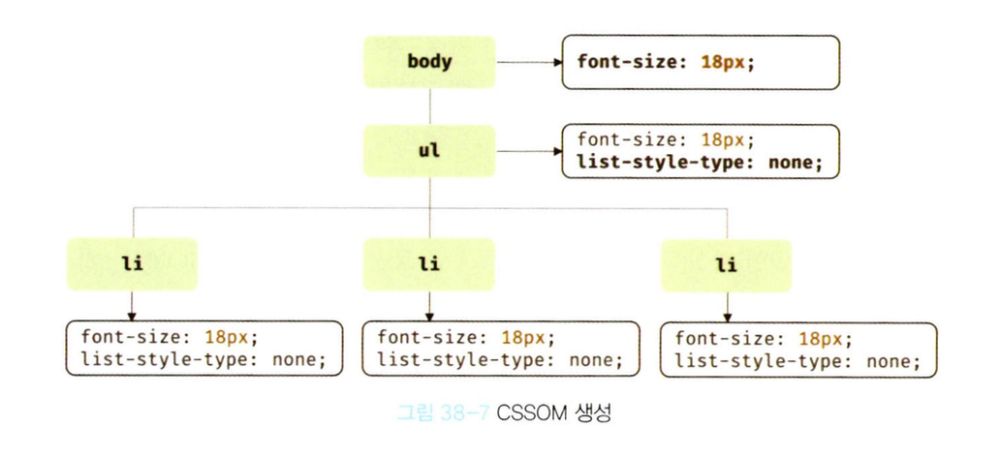
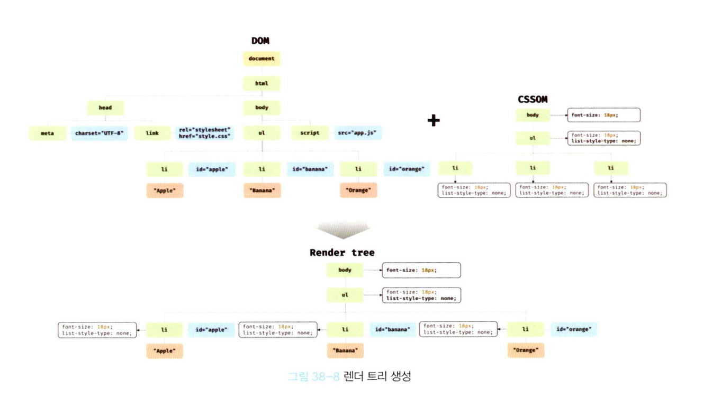
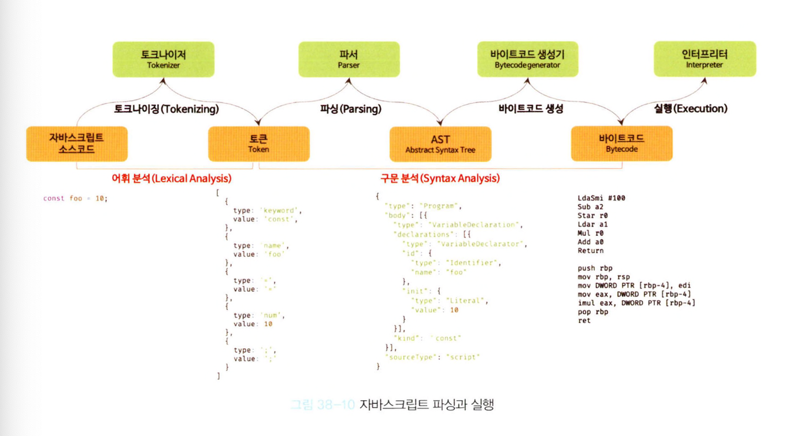

**브라우저의 렌더링 과정**
  1. 브라우저는 HTML, CSS, 자바스크립트, 이미지 폰트 파일 등 렌더링에 필요한 리소스를 요청하고 서버로부터 응답을 받는다.
  2. 브라우저의 렌더링 엔진은 서버로부터 응답된 HTML과 CSSOM을 생성하고 이들을 결합하여 렌더 트리를 생성한다.
  3. 브라우저의 자바스크립트 엔진은 서버로부터 응답된 자바스크립트를 파싱하여 AST(Abstract Syntax Tree)를 생성하고 바이트코드로 변환하여 실행한다. 이때 자바스크립트는 DOM API를 통해 DOM이나 CSSOM을 변경할 수 있다. 변경된 DOM과 CSSOM은 다시 렌더 트리로 결합된다.
  4. 렌더 트리를 기반으로 HTML 요소와 레이아웃(위치와 크기)를 계산하고 브라우저 화면에 HTML 요소를 페인팅한다.

## 38.1 요청과 응답
- 브라우저의 핵심 기능: 필요한 리소스를 서버에 요청(렌더링에 필요한 리소스는 모두 서버에 존재)하고 서버가 응답한 리소스를 파싱하여 렌더링 하는 것
  - 리소스: HTML, CSS, 자바스크립트, 이미지, 폰트 등의 정적 파일 또는 서버가 동적으로 생성한 데이터
- 서버에 요청을 전송하기 위해 브라우저의 주소창에 URL을 입력하고 엔터 키를 누르면 URL의 호스트 이름이 DNS를 통해 IP 주소로 변환되고 이 IP 주소를 갖는 서버에게 요청을 전송한다. (정적파일 요청)


- 자바스크립트로 ajax 와 REST API를 통해 동적으로 서버에 정적/동적 데이터를 요청할 수도 있다.

## 38.2 HTTP 1.1과 HTTP 2.0
- HTTP는 웹에서 브라우저와 서버가 통신하기 위한 프로토콜이다.
- HTTP/1.1
  - 커넥션 당 하나의 요청과 응답만 처리하기 때문에 여러개의 요청을 한 번에 전송할 수 없고 여러개의 응답을 한 번에 받을 수 없다.
  - 리소스의 동시 전송이 불가능한 구조이므로 요청할 리소스의 개수에 비례하여 응답 시간도 증가하는 단점이 있다.
- HTTP/2.0
  - 커넥션 당 다중 요청/응답이 가능하기 때문에 HTTP/1.1에 비해 페이지 로드 속도가 약 50% 정도 빠르다고 알려져 있다.
 
## 38.3 HTML 파싱과 DOM 생성
- 브라우저의 요청에 의해 서버가 응답한 HTML 문서는 문자열로 이루어진 순수한 텍스트다. 브라우저의 렌더링 엔진은 순수한 텍스트인 HTML 문서를 파싱하여 브라우저가 이해할 수 있는 자료구조인 DOM을 생성한다.
  ```
  <!DOCTYPE html>
  <html>
    <head>
      <meta charset="UTF-8">
      <link rel="stylesheet" href="style.css">
    </head>
    <body>
      <ul>
        <li id="apple">Apple</li>
        <li id="banana">Banana</li>
        <li id="orange">Orange</li>
      </ul>
      <script src="app.js"></script>
    </body>
  </html>
  ```
  
- DOM은 HTML 문서를 파싱한 결과물이다.

## 38.4 CSS 파싱과 CSSOM 생성
- 렌더링 엔진은 HTML을 처음부터 한 줄씩 순차적으로 파싱하여 DOM을 생성해 나가다가 CSS를 로드하는 Link나 style 태그를 만나면 DOM 생성을 일시 중단한다.
- 그리고 link 태그의 href 어트리뷰트에 지정된 CSS 파일을 서버에 요청하여 로드한 CSS 파일이나 style 태그 내의 CSS를 HTML과 동일한 파싱 과정(바이트->문자->토큰->노드->CSSOM)을 거치며 해석하여 CSSOM을 생성한다.
- 이후 CSS 파싱을 완료하면 HTML 파싱이 중단된 지점부터 다시 HTML을 파싱하기 시작하여 DOM 생성을 재개한다.
  ```
  body {
    font-size: 18px;
  }
  ul {
    list-style-type: none;
  }
  ```
  

## 38.5 렌더 트리 생성
- 렌더링 엔진은 서버로부터 응답된 HTML과 CSS를 파싱하여 각각 DOM과 CSSSOM을 생성하고, 렌더링을 위해 렌더트리로 결합된다.
- 렌더 트리는 렌더링을 위한 트리 구조의 자료구조다. 따라서 브라우저 화면에 렌더링 되지 않는 노드(ex. meta 태그, script 태그 등)와 CSS에 의해 비표시(ex. display: none) 되는 노드들은 포함하지 않는다.

- 이후 완성된 렌더 트리는 각 HTML 요소의 레이아웃(위치와 크기)을 계산하는 데 사용되며 브라우저 화면에 픽셀을 렌더링하는 페인팅 처리에 입력된다.
- 브라우저의 렌더링 과정은 반복해서 실행될 수 있지만, 리렌더링은 성능에 악영향을 주는 작업이므로 주의할 필요가 있다.
  - 자바스크립트에 의한 노드 추가 또는 삭제
  - 브라우저 창의 리사이징에 의한 뷰포트 크기 변경
  - HTML 요소의 레이아웃(위치, 크기)에 변경을 발생시키는 width/height, margin, padding, border, display, position, top/right/bottom/left 등의 스타일 변경

## 38.6 자바스크립트 파싱과 실행
- 자바스크립트 파싱과 실행은 브라우저의 렌더링 엔진이 아닌 자바스크립트 엔진이 처리한다. 자바스크립트 엔진은 자바스크립트 코드를 파싱하여 CPU가 이해할 수 있는 저수준 언어로 변환하고 실행하는 역할을 한다. 
- 렌더링 엔진으로부터 제어권을 넘겨받은 자바스크립트 엔진은 자바스크립트 코드를 파싱하기 시작한다. 렌더링 엔진이 HTML과 CSS를 파싱하여 DOM과 CSSOM을 생성하듯이 자바스크립트 엔진은 자바스크립트를 해석하여 AST(Abstract Syntax Tree(추상적 구문 트리))를 생성한다. 그리고 AST를 기반으로 인터프리터가 실행할 수 있는 중간 코드인 바이트코드를 생성하여 실행한다.


## 38.7 리플로우와 리페인트
- 자바스크립트 코드에 DOM이나 CSSOM을 변경하는 DOM API가 사용된 경우 DOM이나 CSSSOM이 변경된다. 이때 변경된 DOM과 CSSOM은 다시 렌더 트리로 결합되고 변경된 렌더 트리를 기반으로 레이아웃과 페인트 과정을 거쳐 브라우저의 화면에 다시 렌더링한다. 이를 리플로우, 리페인트라고 한다.

## 38.8 자바스크립트 파싱에 의한 HTML 파싱 중단
- 브라우저는 위에서 아래 방향으로 순차적으로 HTML, CSS, 자바스크립트를 파싱하고 실행하기 떄문에 script 태그 위치에 따라 HTML 파싱이 블로킹되어 DOM 생성이 지연될 수 있다.
- 아래와 같은 이유로 자바스크립트는 body 요소의 가장 아래에 위치시키는 것이 좋다.
  - DOM이 완성되지 않은 상태에서 자바스크립트가 DOM을 조작하면 에러가 발생할 수 있다.
  - 자바스크립트 로딩/파싱/실행으로 인해 HTML 요소들이 렌더링에 지장받는 일이 발생하지 않아 페이지 로딩 시간이 단축된다.

## 38.9 script 태그의 async/defer 어트리뷰트
- 자바스크립트 파싱에 의한 DOM 생성이 중단되는 문제를 해결하기 위해 HTML5부터 script 태그에 async와 defer 어트리뷰트가 추가되었다.
- async와 defer 어트리뷰트는 src 어트리뷰트를 통해 외부 자바스크립트 파일을 로드하는 경우에만 사용할 수 있고, src 어트리뷰트가 없는 인라인 자바스크립트에는 사용할 수 없다.

  **async 어트리뷰트**
  - HTML 파싱와 외부 자바스크립트 파일의 로드가 비동기적으로 동시에 진행된다.
  - 자바스크립트의 파싱과 실행은 자바스크립트 파일의 로드가 완료된 직후 진행되며, 이때 HTML 파싱이 중단된다.
  - 여러 개의 script 태그에 async 어트리뷰트를 지정하면 script 태그의 순서와는 상관없이 로드가 완료된 자바스크립트부터 먼저 실행되므로 순서가 보장되지 않는다.
  

  **defer 어트리뷰트**
  - async 어트리뷰트와 마찬가지로 HTML 파싱과 외부 자바스크립트 파일의 로드가 비동기적으로 동시에 진행된다.
  - 자바스크립트의 파싱과 실행은 HTML 파싱이 완료된 직후, 즉 DOM 생성이 완료된 직후에 진행되기 떄문에 DOM 생성이 완료된 이후 진행되어야 할 자바스크립트에 유용한다.
  
