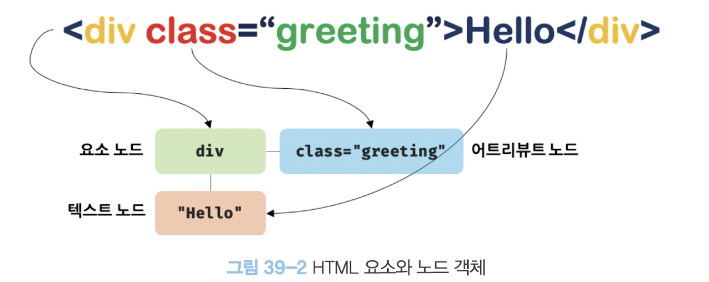
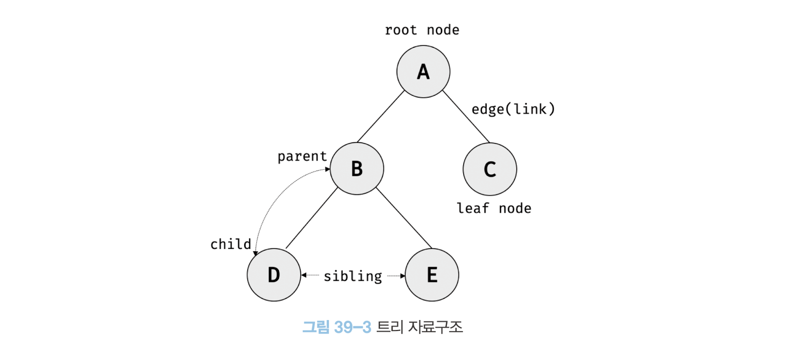
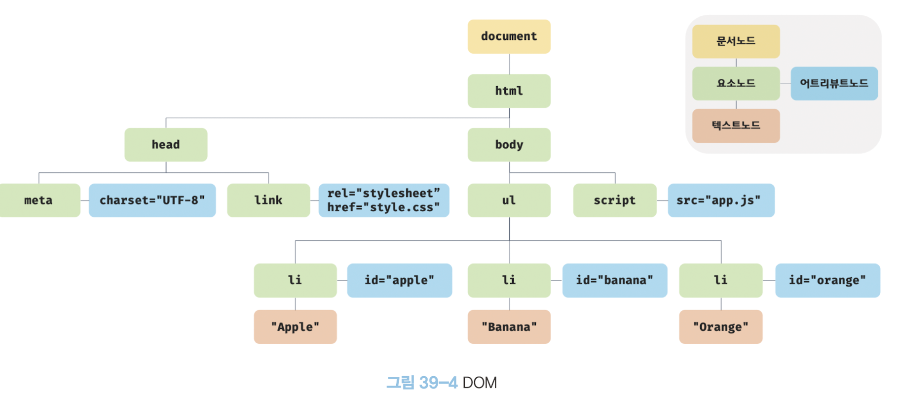
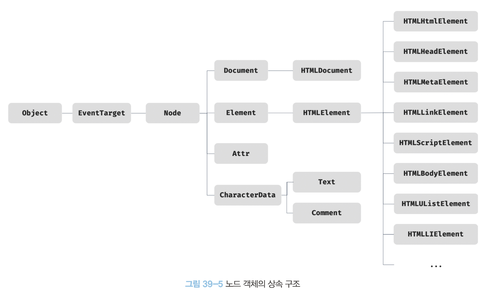
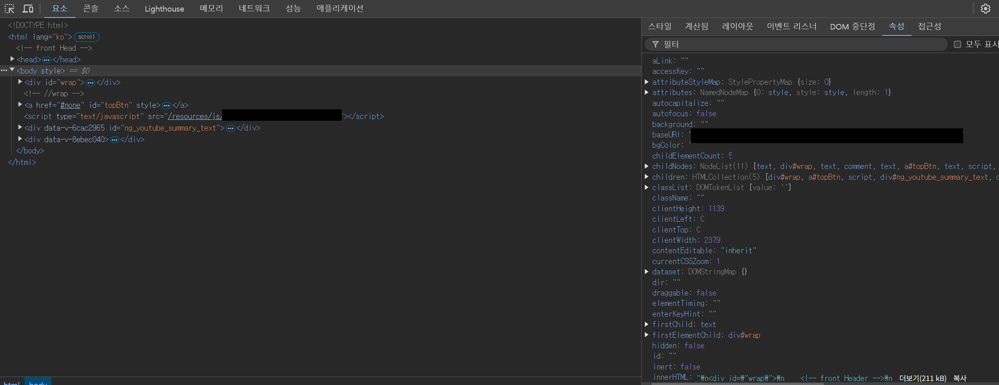
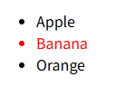
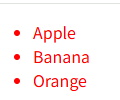
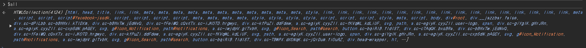

# DOM

- 브라우저의 렌더링 엔진은 HTML 문서를 파싱하여 브라우저가 이해할 수 있는 자료구조인 DOM을 생성한다. DOM(Document Object Model)은 HTML 문서의 계층적 구조와 정보를 표현하면 이를 제어할 수 있는 API, 즉 프로퍼티와 메서드를 제공하는 트리 자료구조다.


## 39.1 노드
### 39.1.1 HTML 요소와 노드 객체
- HTML 요소 HTML element는 HTML 문서를 구성하는 개별적인 요소를 의미한다.

- HTML 요소는 렌더링 엔진에 의해 파싱되어 DOM을 구성하는 요소 노드 객체로 변환된다. 이때 HTML 요소의 어트리뷰트는 어트리뷰트 노드로, HTML 요소의 텍스트 콘텐츠는 텍스트 노드로 변환된다.

- HTML 문서는 HTML 요소들의 집합으로 이뤄지며, HTML 요소는 중첩 관계를 갖는다.

    

- HTML 요소 간에는 중첩 관계에 의해 계층적인 부자parent-child 관계가 형성된다. 이러한 HTML 요소 간의 부자 관계를 반영하여 HTML 문서의 구성 요소인 HTML 요소를 객체화한 모든 노드 객체들을 트리 자료구조로 구성한다.

- 노드 객체들로 구성된 트리 자료구조를 DOM이라 한다. 노드 객체의 트리르 구조화되어 있기 때문에 DOM을 DOM 트리라고 부르기도 한다.

#### 트리 자료구조
- 트리 자료구조는 노드들의 계층 구조로 이뤄진다.

- 노드 객체들로 구성된 트리 자료구조를 DOM이라 한다. 노드 객체의 트리로 구조화되어 있기 때문에 DOM을 DOM트리라고 부르기도 한다.

    


### 39.1.2 노드 객체의 타입
- 렌더링 엔진은 HTML 문서를 파싱하여 DOM을 생성한다.
- 노드 객체는 총 12개의 종류(노드 타입)가 있다. 이 중에서 중요한 노드 타입은 다음과 같이 4가지다.

    - 문서노드 document node
    - 요소 노드 element node
    - 어트리뷰트 노드 attribute node
    - 텍스트 노드 text node

    

#### 문서 노드
- 문서 노드는 DOM 트리의 퇴상위에 존재하는 루트 노드로서 document 객체를 가리킨다.

- 문서 노드, 즉 document 객체는 DOM 트리의 루트 노드이므로 DOM 트리의 노드들에 접근하기 위한 진입점 역할을 담당한다. 즉, 요소, 어트리뷰트, 텍스트 노드에 접근하려면 문서 노드를 통해야 한다.

#### 요소 노드
- 요소 노드는 HTML 요소를 가리키는 객체다.
- 요소 노드는 HTML 요소 간의 중첩에 의해 부자 관계를 가지며, 이 부자 관계를 통해 정보를 구조화 한다. 따라서 요소 소드는 문서의 구조를 표현한다고 할 수 있다.

#### 어트리뷰트 노드
- 어트리뷰트 노드는 HTML 요소의 어트리뷰트를 가리키는 객체다.
- 요소 노드는 부모 노드와 연결되어 있지만 어트리뷰트 노드는 부모 노드와 연결되어 있지 않고 요소 노드에만 연결되어 있다.
- 따라서 어트리뷰트 노드에 접근하여 어트리뷰트를 참조하거나 변경하려면 먼저 요소 노드에 접근해야 한다.

#### 텍스트 노드
- 텍스트 노드는 HTML 요소의 텍스트를 가리키는 객체다. 텍스트 노드는 문서의 정보를 표현한다고 할 수 있다. 텍스트 노드는 요소의 자식노드이며, DOM 트리의 최종단이다. 따라서 텍스트 노드에 접근하려면 부모 노드인 요소 노드에 접근해야 한다.


### 39.1.3 노드 객체의 상속 구조 

 

- 노드 객체도 자바스크립트 객체이므로 프로토타입에 의한 상속 구조를 갖는다.
- 모든 노드 객체는 Object, EventTarget, Node 인터페이스를 상속받는다.
- DOM은 HTML 문서의 계층적 구조와 정보를 표현하는 것은 물론 노드 객체의 종류, 즉 노드 타입에 따라 필요한 기능을 프로퍼티와 메서드의 집합인 DOM API로 제공한다. 이 DOM API를 통해 HTML의 구조나 내용 또는 스타일 등을 동적으로 조작할 수 있다.
- 노드 객체의 상속 구조는 개발자 도구의 elements 패널 우측의 properties 패널에서 확인할 수 있다.

    

## 39.2 요소 노드 취득
### 39.2.1 id를 이용한 요소 취득
- Document.prototype.getElementById 메서드는 인수로 전달된 id 어트리뷰트 값(이하 id 값)을 갖는 하나의 요소 노드를 탐색하여 반환한다. 
- getElementById 메서드는 Document.prototype의 프로퍼티다. 따라서 반드시 문서 노드인 document를 통해 호출해야 한다.

    ```js
    <!DOCTYPE html>
        <html>
            <body>
                <ul>
                    <li id="apple">Apple</li>
                    <li id="banana">Banana</li>
                    <li id="orange">Orange</li>
                </ul>
                <script>
                    //id 값이 'banana'인 요소 노드를 탐색하여 반환한다.
                    //두 번째 li 요소가 파싱되어 생성된 요소 노드가 반환된다.
                    const $elem = document.getElementById('banana');

                    //취득한 요소 노드의 style.color 프로퍼티 값을 변경한다
                    $elem.style.color = 'red';
                </script>
            </body>
        </html>
    ```
    
    

    - id 값은 HTML 문서 내에서 유일한 값이어야 한다.
    - 공백 문자로 구분하여 여러 개의 값을 가질 수 없다.
    - 중복된 id 값을 갖는 요소가 여러 개 존재할 수 있으며 에러 발생 대신 id 값을 갖는 첫 번째 요소 노드만 반환한다.
    - 인수로 전달된 id 값을 갖는 HTML 요소가 존재하지 않는 경우 getElementById 메서드는 null을 반환한다.
    ```js
    const elem = document.getElementById('없는아이디'); // elem은 null
    ```


- HTML 요소에 id 어트리뷰티를 부여하면 id 값과 동일한 이름의 전역 변수가 암묵적으로 선언되고 해당 노드 객체가  할당되는 부수 효과가 있다.
    ```js
    <!DOCTYPE html>
    <html>
        <body>
            <div id="foo"></div>
            <script>
                //id 값과 동일한 이름의 전역 변수가 암묵적으로 선언되고 해당 노드 객체가 할당된다.
                
                console.log(foo === document.getElementById('foo')); //true
                
                //암묵적 전역으로 생성된 전역 프로퍼티는 삭제되지만 전역 변수는 삭제되지 않는다.
                delete foo;
                console.log(foo); //<div id="foo"></div>
            </script>
        </body>
    </html>
    ```

    - 단, id 값과 동일한 이름의 전역 변수가 이미 선언되어 있으면 이 전역 변수에 노드 객체가 재할당되지 않는다.

    ### 39.2.2 태그 이름을 이용한 요소 노드 취득
    - Document.prototype/Element.prototype.getElementsByTagName 메서드는 인수로 전달한 태그 이름을 갖는 모든 요소들을 탐색하여 반환한다.
    - getElementsByTagName 메서드는 여러 개의 노드 객체를 갖는 DOM 컬렉션 객체인 HTMLCollection 객체를 반환한다.
    ```js
        <!DOCTYPE html>
        <html>
            <body>
                <ul>
                    <li id="apple">Apple</li>
                    <li id="banana">Banana</li>
                    <li id="orange">Orange</li>
                </ul>
                <script>
                    //태그 이름이 li인 요소 노드를 모두 탐색하여 반환한다.
                    //탐색된 요소 노드들은 HTMLCollection 객체에 담겨 반환된다.
                    //HTMLCollection 객체는 유사 배열 객체이면서 이터러블이다.
                    const $elems = document.getElementsByTagName('li');
                    
                    //취득한 모든 요소 노드의 style.color 프로퍼티 값을 변경한다.
                    //HTMLCollection 객체를 배열로 변환하여 순회하며 color 프로퍼티 값을 변경한다.
                    [...$elems].forEach(elem => { elem.style.color = 'red'; });
                </script>
            </body>
        </html>
    ```
    
    
     -  getElementsByTagName 메서드가 반환하는 DOM 컬렉션 객체인 HTMLCollection 객체는 유사 배열 객체이면서 이터러블이다.
     - HTML 문서의 모든 요소 노드를 취득하려면 getElementsByTagName 메서드의 인수로 ' * '를 전달한다.
     ```js
     const $all = document.getElementsByTagName('*')
     ```
     
     - Document.prototype.getElementsByTagName 메서드는 document를 통해 호출하며 DOM 전체에서 요소 노드를 탐색하여 반환한다.(getElementsByClassName도 동일)

     ```js
        <!DOCTYPE html>
        <html>
            <body>
                <ul id="fruits">
                <li>Apple</li>
                <li>Banana</li>
                <li>Orange</li>
                </ul>
                <ul>
                <li>HTML</li>
                </ul>
                <script>
                // DOM 전체에서 태그 이름이 li인 요소 노드를 모두 탐색하여 반환한다.
                const $lisFromDocument = document.getElementsByTagName('li');
                console.log($lisFromDocument); // HTMLCollection(4) [li, li, li, li]

                // ul#fruits 요소의 자손 노드 중에서 태그 이름이 li인 요소 노드를 모두 탐색하여 반환한다.
                const $fruits = document.getElementById('fruits');
                const $lisFromFruits = $fruits.getElementsByTagName('li');
                console.log($lisFromDocument); // HTMLCollection(3) [li, li, li]
                </script>
            </body>
        </html>
    ```
     - Element. prototype. getElementsByTagName 메서드는 특정 요소 노드를 통해 호출하며, 특정 요소 노드의 자손 노드 중에서 요소 노드를 탐색하여 반환한다.(getElementByClassName도 동일)

    ```js
    <!DOCTYPE html>
        <html>
        <body>
            <ul id="fruits">
            <li>Apple</li>
            <li>Banana</li>
            <li>Orange</li>
            </ul>
            <ul>
            <li>HTML</li>
            </ul>
            <script>
            // DOM 전체에서 태그 이름이 li인 요소 노드를 모두 탐색하여 반환한다.
            const $lisFromDocument = document.getElementsByTagName('li');
            console.log($lisFromDocument); // HTMLCollection(4) [li, li, li, li]

            // ul#fruits 요소의 자손 노드 중에서 태그 이름이 li인 요소 노드를 모두 탐색하여 반환한다.
            const $fruits = document.getElementById('fruits');
            const $lisFromFruits = $fruits.getElementsByTagName('li');
            console.log($lisFromDocument); // HTMLCollection(3) [li, li, li]
            </script>
        </body>
        </html>
    ```
    - 인수로 전달된 태그 이름을 갖는 요소가 존재하지 않는 경우 빈 HTMLCollection 객체를 반환한다.

   