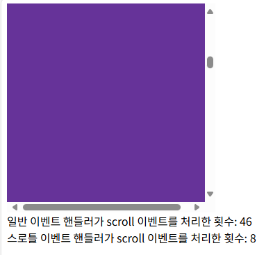

## 41.1 호출 스케줄링
- 타이머 함수를 사용하여 일정 시간이 경과된 이후에 호출되도록 함수 호출을 예약하는 것을 호출 스케줄링이라 한다.
- 자바스크립트 엔진은 단 하나의 실행 컨텍스트 스택을 갖기 때문에 두 가지 이상의 태스크를 동시에 실행할 수 없다. 즉, 자바스크립트 엔진은 싱글 스레드로 동작한다. 이런 이유로 타이머 함수 setTimeout과 setInterval은 비동기 처리 방식으로 동작한다.

## 41.2 타이머 함수
### 41.2.1 setTimeout / clearTimeout
- setTimeout 함수의 콜백 함수는 두 번째 인수로 전달받은 시간 이후 단 한 번 실행되도록 호출 스케줄링된다.
- 호출 스케줄링된 콜백 함수에 전달해야 할 인수가 존재하는 경우 세 번째 이후의 인수로 전달할 수 있다.
  ```js
  const timeoutId = setTimeout(func|code[, delay, param1, param2, ...]);
  ```
  ```js
  setTimeout(() => console.log('Hi!'), 1000);
  setTimeout(name => console.log(`Hi! ${name}`), 1000, 'Lee');
  setTimeout(() => console.log('Hi!')); // 두 번째 인수를 생략하면 기본값 0이 지정된다
  ```js
- setTimeout 함수가 반환한 타이머 id를 clearTimeout 함수의 인수로 전달하여 타이머를 취소할 수 있다.
  ```js
  const timerid = setTimeout(() => console.log('Hi!'), 1000);
  clearTimeout(timerid);
  ```

### 41.2.2 setInterval / clearInterval
- setInterval 함수의 콜백 함수는 두 번째 인수로 전달받은 시간이 경과할 때마다 반복 실행되도록 호출 스케줄링된다.
  ```js
  const timerId = setInterval(func|code[, delay, param1, param2, ...]);
  ```
- setInterval 함수가 반환한 타이머 id를 clearInterval 함수의 인수로 전달하여 타이머를 취소할 수 있다.
  ```js
  let count = 1;
  
  const timeoutId = setInterval(() => {
    console.log(count); // 1 2 3 4 5
   
    if (count++ === 5) clearInterval(timeoutId);
  }, 1000);
  ```

## 41.3 디바운스와 스로틀
- scroll, resize, input, mousemove 같은 이벤트는 짧은 시간 간격으로 연속해서 발생하기 때문에 과도하게 호출되어 성능에 문제를 일아킬 수 있다.
- 디바운스와 스로틀은 짧은 시간 간격으로 연속해서 발생하는 이벤트를 그룹화해서 과도한 이벤트 핸들러의 호출을 방지하는 프로그래밍 기법이다.
- 디바운슨느 주로 ajax 검색에서 사용하고, 스로틀은 스크롤에서 많이 사용한다.

### 41.3.1 디바운스
- 디바운스는 짧은 시간 간격으로 이벤트가 연속해서 발생하면 이벤트 핸들러를 호출하지 않다가 일정 시간이 경과한 이후에 이벤트 핸들러가 한 번만 호출되도록 한다.
  ```html
  <input type="text" />
  <div class="msg"></div>

  <script>
    const $input = document.querySelector('input');
    const $msg = document.querySelector('.msg');

    const debounce = (callback, delay) => {
      let timerid;

      return event => {
        if (timerid) clearTimeout(timerid);
        timerid = setTimeout(callback, delay, event);
      };
    };

    $input.oninput = debounce(e => {
      $msg.textContent = e.target.value;
    }, 300);
  </script>
  ```
  
- 예를 들어, '안녕'이라는 단어를 검색한다고 하면 'ㅇ', '아', '안', '안ㄴ', '안녀', '안녕' 이렇게 6번의 Ajax 요청이 실행된다.
- 이는 서버에도 부담을 주는 불필요한 처리이며, 유료 API를 사용하는 경우 쿼리 하나하나가 돈이기 때문에 엄청난 손해가 발생한다.
- 따라서 '안녕' 이라는 단어를 다 입력하였을 때 한 번만 Ajax 요청을 하는 것이 바람직하다.

- 디바운스는 resize 이벤트 처리나 input 요소에 입력된 값으로 Ajax 요청하는 입력 필드 자동완성 UI 구현, 버튼 중복 클릭 방지 처리 등에 유용하게 사용된다.
- 실무에서는 위의 예제보다는 Underscore의 debounce 함수나 lodash의 debounce 함수를 사용하는 것을 권장한다.

### 41.3.2 스로틀
- 스로틀은 짧은 시간 간격으로 이벤트가 연속해서 발생하더라도 일정 시간 간격으로 이벤트 핸들러가 최대 한 번만 호출되도록 한다.
  ```html
  <!DOCTYPE html>
  <html lang="en">
  <head>
    <meta charset="UTF-8">
    <meta name="viewport" content="width=device-width, initial-scale=1.0">
    <title>Document</title>
    <style>
      .container {
        width: 300px;
        height: 300px;
        background-color: rebeccapurple;
        overflow: scroll;
      }
      .content {
        width: 300px;
        height: 1000vh;
      }
    </style>
  </head>
  <body>
    <div class="container">
      <div class="content"></div>
    </div>
    <div>
      일반 이벤트 핸들러가 scroll 이벤트를 처리한 횟수: 
      <span class="normal-count">0</span>
    </div>
    <div>
      스로틀 이벤트 핸들러가 scroll 이벤트를 처리한 횟수:
      <span class="throttle-count">0</span>
    </div>

    <script>
      const $container = document.querySelector('.container');
      const $normalCount = document.querySelector('.normal-count');
      const $throttleCount = document.querySelector('.throttle-count');

      const throttle = (callback, delay) => {
        let timerid;

        return event => {
          if (timerid) return;
          timerid = setTimeout(() => {
            callback(event);
            timerid = null;
          }, delay, event);
        };
      };

      let normalCount = 0;
      $container.addEventListener('scroll', () => {
        $normalCount.textContent = ++normalCount;
      });

      let throttleCount = 0;
      $container.addEventListener('scroll', throttle(() => {
        $throttleCount.textContent = ++throttleCount;
      }, 100));
    </script>
  </body>
  </html>
  ```
  
- scroll 처럼 짧은 시간 간격으로 연속해서 발생하는 이벤트의 과도한 이벤트 핸들러의 호출을 방지하기 위해 throttle 함수는 이벤트를 그룹화해서 일정 시간 단위로 이벤트 핸들러가 호출되도록 호출 주기를 만든다.
- 스로틀은 scroll 이벤트 처리나 무한 스크롤 UI 구현 등에 유용하게 사용된다.
- 실무에서는 위의 예제보다는 Underscore의 throttle 함수나 lodash의 throttle 함수를 사용하는 것을 권장한다.


참고: https://webclub.tistory.com/607

