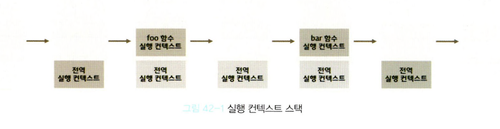
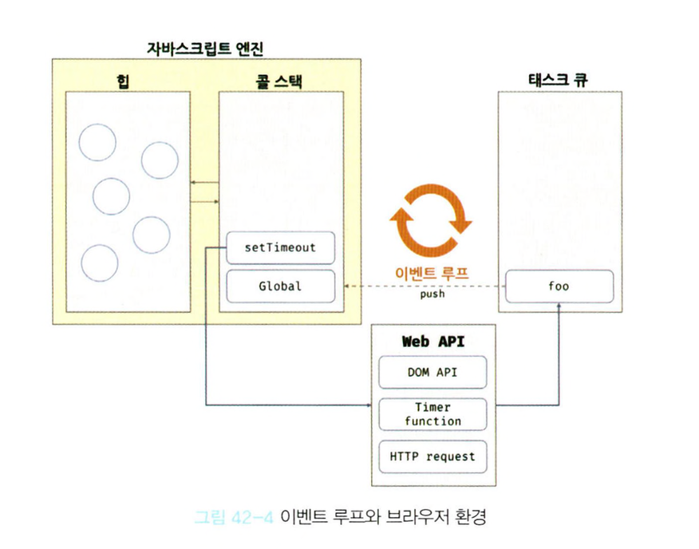

## 42.1 동기 처리와 비동기 처리

- 함수가 실행되려면 함수 실행 컨텍스트가 실행 컨텍스트 스택에 푸시되어야 하며, 실행 컨텍스트 스택에 함수 실행 컨텍스트가 푸시되는 것은 함수 실행의 시작을 의미한다.
- 함수의 실행 순서는 실행 컨텍스트 스택으로 관리한다.
- **자바스크립트 엔진은 단 하나의 실행 컨텍스트 스택을 갖는다.** 이는 2개 이상의 함수를 동시에 실행할 수 없다는 것을 의미한다.
- 자바스크립트 엔진은 싱글 스레드 방식으로 동작한다. 싱글 스레드 방식은 한 번에 하나의 태스크만 실행할 수 있기 때문에 처리에 시간이 걸리는 태스크를 실행하는 경우 블로킹(작업중단)이 발생한다.
- 동기 처리: 현재 실행 중인 태스크가 종료할 때까지 다음에 실행될 태스크가 대기하는 방식
  - 장점: 태스크를 순서대로 하나씩 처리하므로 실행 순서가 보장됨
  - 단점: 앞선 태스크가 종료될 때까지 이후 태스크들이 블로킹 됨
- 비동기 처리: 현재 실행 중인 태스크가 종료되지 않은 상태라 해도 다음 태스크를 곧바로 실행하는 방식
  - 장점: 블로킹이 발생하지 않음
  - 단점: 태스크의 실행 순서가 보장되지 않음
  - setTimeout, setInterval, HTTP 요청, 이벤트 핸들러

## 42.2 이벤트 루프와 태스크 큐
- 브라우저에 내장되어 있는 기능 중 하나인 이벤트 루프는 자바스크립트의 동시성을 지원한다.

- 자바스크립트 엔진은 크게 2개의 영역으로 구분할 수 있다.
  - 콜 스택
    - 소스 코드 평가 과정에서 생성된 실행 컨텍스트가 추가되고 제거되는 스택 자료구조인 실행 컨텍스트 스택
    - 함수를 호출하면 함수 실행 컨텍스트가 순차적으로 콜 스택에 푸시되어 순차적으로 실행된다. 자바스크립트 엔진은 단 하나의 콜 스택을 사용하기 때문에 최상위 실행 컨텍스트(실행 중인 실행 컨텍스트)가 종료되어 콜 스택에서 제거되기 전까지는 다른 어떤 태스크도 실행되지 않는다.
  - 힙
    - 객체가 저장되는 메모리 공간. 콜 스택의 요소인 실행 컨텍스트는 힙에 저장된 객체를 참조한다.
    - 메모리에 값을 저장하려면 먼저 값을 저장할 메모리 공간의 크기를 결정해야 한다. 객체는 원시 값과는 달리 크기가 정해져 있지 않으므로 할당해야 할 메모리 공간의 크기를 런타임에 결정(동적 할당)해야 한다. 따라서 객체가 저장되는 메모리 공간인 힙은 구조화 되어 있지 않다는 특징이 있다.
- 비동기 방식으로 동작하는 setTimeout의 콜백 함수의 평가와 실행 => 자바스크립트 엔진 담당   
- 호출 스케줄링을 위한 타이머 설정과 콜백 함수의 등록 => 브라우저 또는 Node.js 담당
- 브라우저 환경은 태스크 큐와 이벤트 루프를 제공한다.
  - 태스크 큐
    - setTimeout 이나 setInterval과 같은 비동기 함수의 콜백 함수 또는 이벤트 헨들러가 일시적으로 보관되는 영역
  - 이벤트 루프
    - 이벤트 루프는 콜 스택에 현재 실행 중인 실행 컨텍스트가 있는지, 태스크 큐에 대기 중인 함수(콜백 함수, 이벤트 핸들러 등)가 있는지 반복해서 확인한다.
    - 만약 콜 스택이 비어있고 태스크 큐에 대기 중인 함수가 있다면 이벤트 루프는 순차적(FIFO, First In First Out)으로 태스크 큐에 대기 중인 함수를 콜 스택으로 이동시키며, 콜 스택으로 이동한 함수는 실행된다.
    - 태스트 큐에 일시 보관된 함수들은 비동기 처리 방식으로 동작한다.

  ```js
  function foo() {
    console.log('foo');
  }

  function bar() {
    console.log('bar');
  }

  setTimeout(foo, 0);
  bar();
  ```
- 비동기 함수인 setTimeout의 콜백 함수는 태스크 큐에 푸시되어 대기하다가 콜 스택이 비게 되면(전역 코드 및 명시적으로 호출된 함수가 모두 종료하면) 콜 스택에 푸시되어 실행된다.
- 자바스크립트는 싱글 스레드 방식으로 동작한다. 이때 싱글 스레드 방식으로 동작하는 것은 브라우저가 아니라 브라우저에 내장된 자바스크립트 엔진이라는 것에 주의해야 한다.
- 자바스크립트 엔진은 싱글 스레드로 동작하지만 브라우저는 멀티 스레드로 동작하기 때문에 자바스크립트가 비동기로 동작할 수 있는 것이다.
