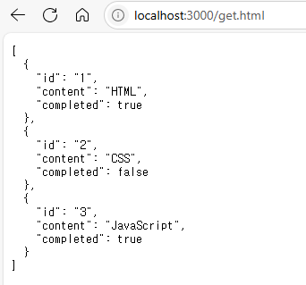
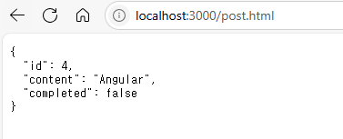
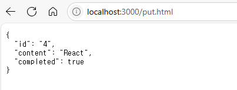
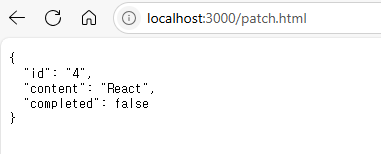

- REST: HTTP를 기반으로 클라이언트가 서버의 리소스에 접근하는 방식을 규정한 아키텍처
- REST API: REST를 기반으로 서비스 API를 구현한 것
- RESTful: REST의 기본 원칙을 성실히 지킨 서비스 디자인

## 44.1 REST API의 구성
|구성 요소|내용|표현 방법|
|---|---|---|
|자원|자원|UR(엔드포인트)|
|행위|자원에 대한 행위|HTTP 요청 메서드|
|표현|자원에 대한 행위의 구체적 내용|페이로드|

## 44.2 REST API 설계 원칙
아래의 두 가지 원칙이 RESTful API를 설계하는 중심 규칙이다.
1. URI는 리소스를 표현해야 한다.
- 리소스를 식별할 수 있는 이름은 동사보다는 명사를 사용하기 때문에 이름에 get 같은 행위에 대한 표현이 들어가서는 안 된다.
  ```
  # bad
  GET /getTodos/1
  GET /todos/show/1

  # good
  GET /todos/1
  ```
2. 리소스에 대한 행위는 HTTP 요청 메서드로 표현한다.
- HTTP 요청 메서드는 클라이언트가 서버에게 요청의 종류와 목적(리소스에 대한 행위)을 알리는 방법이다. 
- 주로 5가지 요청 메서드(GET, POST. PUT. PATCH, DELETE 등)를 사용하여 CRUD를 구현한다.

  |HTTP 요청 메서드|종류|목적|페이로드|
  |---|---|---|---|
  |GET|index/retrieve|모든/특정 리소스 취득|X|
  |POST|create|리소스 생성|O|
  |PUT|replace|리소스의 전체 교체|O|
  |PATCH|modify|리소스의 일부 수정|O|
  |DELETE|delete|모든/특정 리소스 삭제|X|

- 리소스에 대한 행위는 HTTP 요청 메서드를 통해 표현하며 URI에 표현하지 않는다.
  ```
  # bad
  GET /todos/delete/1

  # good
  DELETE /todos/1
  ```

## 44.3 JSON Server를 이용한 REST API 실습
### 44.3.1 JSON Server 설치
- JSON Server는 json 파일을 사용하여 가상 REST API 서버를 구축할 수 있다.
- npm을 사용하여 JSON Server 설치
  ```
  mkdir json-server-exam && cd json-server-exam
  npm init -y
  npm install json-server--save-dev
  ```

### 44.3.2 db.json 파일 생성
- 프로젝트 루트 폴더에 db.json 파일을 생성한다.
  ```json
  {
    "todos": [
      {
        "id": 1,
        "content": "HTML",
        "completed": true
      },
      {
        "id": 2,
        "content": "CSS",
        "completed": false
      },
      {
        "id": 3,
        "content": "JavaScript",
        "completed": true
      }
    ]
  }
  ```

### 44.3.3 JSON Server 실행
- 터미널에서 다음과 같이 명령어를 입력하여 JSON Server를 실행한다.
- JSON Server가 데이터베이스 역할을 하는 db.json 파일의 변경을 감지하게 하려면 watch 옵션을 추가한다.
  ```
  ## 기본 포트(3000) 사용 / watch 옵션 적용
  $ json-server --watch db.json

  ## 포트 변경 / watch 옵션 적용
  $ json-server --watch db.json --port 5000
  ```
- 매번 명령어를 입력하는 것이 번거로우니 package, json 파일의 scripts를 다음과 같이 수정한 후 터미널에서 npm start 명령어를 입력하여 JSON Server를 실행한다.
  ```json
  "scripts": {
    "start": "json-server --watch db.json"
  }
  ```
  ```
  $ npm start
  ```

## 44.3.4 GET 요청
- todos 리소스에서 todo를 취득한다.
- 루트폴더에 public 폴더를 생성하고 get.html을 추가하고 http://localhost:3000/get.html로 접속한다.
  ```html
  <!DOCTYPE html>
  <html lang="en">
  <head>
    <meta charset="UTF-8">
    <meta name="viewport" content="width=device-width, initial-scale=1.0">
    <title>Document</title>
  </head>
  <body>
    <pre></pre>
    <script>
      // XMLHttpRequest 객체 생성
      const xhr = new XMLHttpRequest();
      // HTTP 요청 초기화
      xhr.open('GET', '/todos');
      // HTTP 요청 전송
      xhr.send();
      // load 이벤트는 요청이 성공적으로 완료된 경우 발생
      xhr.onload = () => {
        if (xhr.status === 200) {
          document.querySelector('pre').textContent = xhr.response;
        } else {
          console.log('Error', xhr.status, xhr.statusText);
        }
      }
    </script>
  </body>
  </html>
  ```

  

- todos 리소스에서 id를 사용하여 특정 todo를 취득할 수도 있다.
  ```js
  xhr.open('GET', '/todos/1');
  ```

### 44.3.5 POST 요청
- todos 리소스에 새로운 todo를 생성한다.
- POST 요청 시에는 setRequestHeader 메서드를 사용하여 요청 몸체에 담아 서버로 전송할 페이로드의 MIME 타입을 지정해야 한다.
- public/post.html
  ```html
  <!DOCTYPE html>
  <html lang="en">
  <head>
    <meta charset="UTF-8">
    <meta name="viewport" content="width=device-width, initial-scale=1.0">
    <title>Document</title>
  </head>
  <body>
    <pre></pre>
    <script>
      // XMLHttpRequest 객체 생성
      const xhr = new XMLHttpRequest();
      // HTTP 요청 초기화
      xhr.open('POST', '/todos');
      // 요청 몸체에 담아 서버로 전송할 페이로드의 MOME 타입을 지정
      xhr.setRequestHeader('content-type', 'application/json');
      // HTTP 요청 전송
      xhr.send(JSON.stringify({ id: 4, content: 'Angular', completed: false }));
      // load 이벤트는 요청이 성공적으로 완료된 경우 발생
      xhr.onload = () => {
        if (xhr.status === 200 || xhr.status === 201) {
          document.querySelector('pre').textContent = xhr.response;
        } else {
          console.log('Error', xhr.status, xhr.statusText);
        }
      }
    </script>
  </body>
  </html>
  ```

  

### 44.3.6 PUT 요청
- PUT은 특정 리소스 전체를 교체할 때 사용한다.
- public/put.html
  ```html
  <!DOCTYPE html>
  <html lang="en">
  <head>
    <meta charset="UTF-8">
    <meta name="viewport" content="width=device-width, initial-scale=1.0">
    <title>Document</title>
  </head>
  <body>
    <pre></pre>
    <script>
      // XMLHttpRequest 객체 생성
      const xhr = new XMLHttpRequest();
      // HTTP 요청 초기화
      xhr.open('PUT', '/todos/4');
      // 요청 몸체에 담아 서버로 전송할 페이로드의 MOME 타입을 지정
      xhr.setRequestHeader('content-type', 'application/json');
      // HTTP 요청 전송
      xhr.send(JSON.stringify({ id: 4, content: 'React', completed: true }));
      // load 이벤트는 요청이 성공적으로 완료된 경우 발생
      xhr.onload = () => {
        if (xhr.status === 200) {
          document.querySelector('pre').textContent = xhr.response;
        } else {
          console.log('Error', xhr.status, xhr.statusText);
        }
      }
    </script>
  </body>
  </html>
  ```

  

### 44.3.7 PATCH 요청
- PATCH는 특정 리소스의 일부를 수정할 때 사용한다.
- public/patch.html
  ```html
  <!DOCTYPE html>
  <html lang="en">
  <head>
    <meta charset="UTF-8">
    <meta name="viewport" content="width=device-width, initial-scale=1.0">
    <title>Document</title>
  </head>
  <body>
    <pre></pre>
    <script>
      // XMLHttpRequest 객체 생성
      const xhr = new XMLHttpRequest();
      // HTTP 요청 초기화
      xhr.open('PATCH', '/todos/4');
      // 요청 몸체에 담아 서버로 전송할 페이로드의 MOME 타입을 지정
      xhr.setRequestHeader('content-type', 'application/json');
      // HTTP 요청 전송
      xhr.send(JSON.stringify({ completed: false }));
      // load 이벤트는 요청이 성공적으로 완료된 경우 발생
      xhr.onload = () => {
        if (xhr.status === 200) {
          document.querySelector('pre').textContent = xhr.response;
        } else {
          console.log('Error', xhr.status, xhr.statusText);
        }
      }
    </script>
  </body>
  </html>
  ```

  

### 44.3.8 DELETE 요청
- todos 리소스에서 id를 사용하여 todo를 삭제한다.
- public/delete.html
  ```html
  <!DOCTYPE html>
  <html lang="en">
  <head>
    <meta charset="UTF-8">
    <meta name="viewport" content="width=device-width, initial-scale=1.0">
    <title>Document</title>
  </head>
  <body>
    <pre></pre>
    <script>
      // XMLHttpRequest 객체 생성
      const xhr = new XMLHttpRequest();
      // HTTP 요청 초기화
      xhr.open('DELETE', '/todos/4');
      // HTTP 요청 전송
      xhr.send();
      // load 이벤트는 요청이 성공적으로 완료된 경우 발생
      xhr.onload = () => {
        if (xhr.status === 200) {
          document.querySelector('pre').textContent = xhr.response;
        } else {
          console.log('Error', xhr.status, xhr.statusText);
        }
      }
    </script>
  </body>
  </html>
  ```


