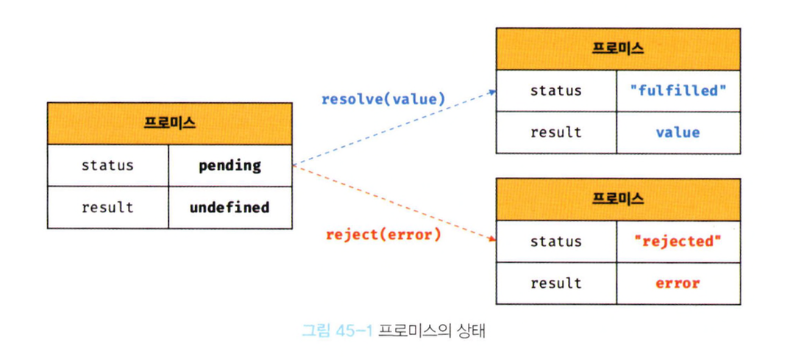

- 자바스크립트는 비동기 처리를 위한 하나의 패턴으로 콜백 함수를 사용한다.
- 하지만 전통적인 콜백 패턴은 콜백 헬로 인해 기독성이 나쁘고 비동기 처리 중 발생한 에러 처리가 곤란하며 여러 개의 비동기 처리를 한 번에 처리하는 데도 한계가 있다.
- ES6에서는 비동기 처리를 위한 또 다른 패턴으로 프로미스를 도입했다.
- 프로미스는 전통적인 콜백 패턴이 가진 단점을 보완하며 비동기 처리 시점을 명확하게 표현할 수 있다는 장점이 있다.

## 45.1 비동기 처리를 위한 콜백 패턴의 단점
### 45.1.1 콜백 헬
- 콜백 함수: 다른 함수의 인자로 전달되어 실행되는 함수
  ```js
  function greet(name, callback) {
    console.log('Hi! ' + name);
    callback();
  }

  greet('Lee', function() {
    console.log('Welcome!');
  });
  ```

- 콜백 헬: 비동기 작업을 처리하기 위해 콜백 함수 안에 콜백 함수가 계속 중첩되는 구조
- 문제점: 가독성↓, 디버깅 어려움, 유지보수 힘듦
  ```js
  get('/step1', a => {
    get(`/step2/${a}`, b => {
      get(`/step3/${b}`, c => {
        get(`/step4/${c}`, d => {
          console.log(d);
        });
      });
    });
  });
  ```

### 45.1.2 에러 처리의 한계
- 비동기 처리를 위한 콜백 패턴의 문제점 중에서 가장 심각한 것은 에러 처리가 곤란하다는 것이다.
  ```js
  try {
    setTimeout(() => { throw new Error('Error!'); }, 1000);
  } catch (e) {
    // 에러를 캐치하지 못한다.
    console.log('캐치한 에러', e);
  }
  ```
- throw는 비동기 함수인 setTimeout 안에서 실행되고 있다. try...catch문은 동기 코드에서만 에러를 잡을 수 있다.
- setTimeout은 나중에 실행되기 때문에 try...catch는 이미 끝나버린 상태이다. 따라서 에러가 전역으로 던져지고, catch 블록은 무시된다.

## 45.2 프로미스의 생성
- Promise 생성자 함수를 new 연산자와 함께 호출하여 프로미스를 생성한다.
- Promise 생성자 함수는 비동기 처리를 수행할 콜백 함수 resolve와 reject를 인수로 전달받는다.
  ```js
  // 프로미스 생성
  const promise = new Promise((resolve, reject) => {
    // Promise 함수의 콜백 함수 내부에서 비동기 처리를 수행한다.
    if (/* 비동기 처리 성공 */) {
      resolve('result');
    } else { /* 비동기 처리 실패 */
      reject('failure reason');
    }
  });
  ```
- 비동기 함수 get을 프로미스를 사용해 다시 구현
  ```js
  const promiseGet = url => {
    return new Promise((resolve, reject) => {
      const xhr = new XMLHttpRequest();
      xhr.open('GET', url);
      xhr.send();

      xhr.onload = () => {
        if (xhr.statue === 200) {
          resolve(JSON.parse(xhr.response));
        } else {
          reject(new Error(xhr.status));
        }
      };
    });
  };

  promiseGet('https://jsonplaceholder.typicode.com/posts/1');
  ```

- 프로미스는 현재 비동기 처리가 어떻게 진행되고 있는지를 나타내는 상태 정보를 갖는다.

  |프로미스의 상태 정보|의미|상태 변경 조건|
  |---|---|---|
  |pending|비동기 처리가 아직 수행되지 않은 상태|프로미스가 생성된 직후 기본 상태|
  |fulfilled|비동기 처리가 수행된 상태(성공)|resolve 함수 호출|
  |rejected|비동기 처리가 수행된 상태(실패)|reject 함수 호출|

- 생성된 직후의 프로미스는 기본적으로 pending 상태이며, 비동기 처리가 수행되면 비동기 처리 결과에 따라 다음과 같이 프로미스의 상태가 변경된다.
  - 비동기 처리 성공: resolve 함수를 호출해 프로미스를 fulfiled 상태로 변경
  - 비동기 처리 실패: reject 함수를 호출해 프로미스를 rejected 상태로 변경

  
- fulfilled 또는 rejected 상태, 즉 pending이 아닌 상태로 비동기 처리가 수행된 상태를 settled 상태라고 한다.
- 프로미스는 비동기 처리 상태와 비동기 처리 결과를 상태로 갖는다.

  
  

## 45.3 프로미스의 후속 처리 메서드
- 프로미스의 바동기 처리 상태가 변화하면 후속 처리 메서드에 인수로 전달한 콜백 함수가 선택적으로 호출된다.
- 모든 후속 처리 메서드는 프로미스를 반환하며, 비동기로 동작한다.
- 후속 처리 메서드: then, catch, finally

### 45.3.1 Promise.prototype.then
- then 메서드는 두 개의 콜백 함수를 인수로 전달받는다.
  - 첫 번째 콜백 함수: 프로미스가 fulfilled 상태(resolve 함수가 호출된 상태)가 되면 호출된다. 이때 콜백함수는 프로미스의 비동기 처리 결과를 인수로 전달받는다.
  - 두 번째 콜백 함수: 프로미스가 rejected 상태(reject 함수가 호출된 상태)가 되면 호출된다. 이때 콜백함수는 프로미스의 에러를 인수로 전달받는다.
  ```js
  // fulfilled
  new Promise(resolve => resolve('fulfilled'))
    .then(v => console.log(v), e => console.log(e)); // fulfilled
    
  // rejected
  new Promise((_, reject) => reject(new Error('rejected')))
    .then(v => console.log(v), e => console.log(e)); // Error: rejected
  ```
- then 메서드는 언제나 프로미스를 반환한다. 만약 then 메서드의 콜백 함수가 프로미스를 반환하면 그 프로미스를 그대로 반환하고, 콜백 함수가 프로미스가 아닌 값을 반환하면 그 값을 암묵적으로 resolve 또는 reject하여 프로미스를 생성해 반환한다.

### 45.3.2 Promise.prototype.catch
- catch 메서드는 한 개의 콜백 함수를 인수로 전달받는다.
- catch 메서드의 콜백 함수는 프로미스가 rejected 상태인 경우만 호출된다.
  ```js
  new Promise((_, reject) => reject(new Error('rejected')))
    .catch(e => console.log(e)); // Error: rejected
  ```
- catch 메서드는 then(undefined, onRejected)과 동일하게 동작하기 때문에 언제나 프로미스를 반환한다.

### 45.3.3 Promise.prototype.finally
- finally 메서드는 한 개의 콜백 함수를 인수로 전달받는다.
- finally 메서드의 콜백 함수는 프로미스의 성공(fulfilled) 또는 실패(rejected)와 상관없이 무조건 한 번 호출된다.
- finally 메서드도 언제나 프로미스를 반환한다.
  ```js
  new Promise(() => {})
    .finally(() => console.log('finally')); // finally
  ```

## 45.4 프로미스의 에러 처리
- then 메서드의 두 번째 콜백 함수로 처리
  ```js
  const wrongUrl = 'https://jsonplaceholder.typicode.com/XXX/1';

  // 부적절한 URL이 지정되었기 때문에 에러가 발생
  promiseGet(wrongUrl).then(
    res => console.log(res),
    err => console.error(err)
  ); // Error: 404
  ```
- 프로미스 후속 처리 메서드 catch를 사용해 처리
  ```js
  const wrongUrl = 'https://jsonplaceholder.typicode.com/XXX/1';

  promiseGet(wrongUrl)
    .then(res => console.log(res))
    .catch(err => concole.error(err)); // Error: 404
  ```
- 에러 처리는 then 메서드에서 하지 말고 catch 메서드에서 하는 것을 권장한다.
  - catch 메서드를 모든 then 메서드를 호출한 이후에 호출하면 비동기 처리에서 발생한 에러(rejected 상태)뿐만 아니라 then 메서드 내부에서 발생한 에러까지 모두 캐치할 수 있다.
  - then 메서드에 두 번째 콜백 함수를 전달하는 것보다 catch 메서드를 사용하는 것이 가독성이 좋고 명확하다.

## 45.5 프로미스 체이닝
```js
const url = 'https://jsonplaceholder.typicode.com';

promiseGet(`${url}/posts/1`)
  .then(({ userId }) => promiseGet(`${url}/users/${userId}`))
  .then(userInfo => console.log(userInfo))
  .catch(err => console.error(err));
```
- then -> then -> catch 순서로 후속 처리 메서드를 호출했다.
- then, catch, finally 후속 처리 메서드는 언제나 프로미스를 반환하므로 연속적으로 호출할 수 있다. 이를 **프로미스 체이닝**이라 한다.
- async/await를 사용하면 프로미스의 후속 처리 메서드 없이 마치 동기 처리처럼 프로미스가 처리 결과를 반환하도록 구현할 수 있다.
  ```js
  const url = 'https://jsonplaceholder.typicode.com';

  (async () => {
    const { userId } = await promiseGet(`${url}/posts/1`);
    const userInfo = await promiseGet(`${url}/users/${userId}`);
    console.log(userInfo);
  })();
  ```

## 45.6 프로미스의 정적 메서드
- Promise는 주로 생성자 함수로 사용되지만 함수도 객체이므로 메서드를 가질 수 있다.
- Promise는 5가지 정적 메서드를 제공한다.

### 45.6.1 Promise.resolve / Promise.reject
- Promise.resolve와 Promise.reject 메서드는 이미 존재하는 값을 래핑하여 프로미스를 생성하기 위해 사용한다.
  ```js
  // 배열을 resolve하는 프로미스를 생성
  const resolvedPromise = Promise.resolve([1, 2, 3]);
  resolvedPromise.then(console.log); // [1, 2, 3]

  // 위 예제와 동일하게 동작
  const resolvedPromise = new Promise(resolve => resolve([1, 2, 3]));
  resolvedPromise.then(console.log); // [1, 2, 3]
  ```
  ```js
  // 에러 객체를 reject하는 프로미스를 생성
  const rejectedPromise = Promise.reject(new Error('Error!'));
  rejectedPromise.catch(console.log); // Error: Error!

  // 위 예제와 동일하게 동작
  const rejectedPromise = new Promise((_, reject) => reject(new Error('Error!')));
  rejectedPromise.catch(console.log); // Error: Error!
  ```

### 45.6.2 Promise.all
- Promise.all 메서드는 여러 개의 비동기 처리를 모두 병렬 처리할 때 사용한다.
- Promise.all 메서드는 인수로 전달받은 배열의 모든 프로미스가 fulfilled 상태가 되면 resolve된 처리 결과를 모두 배열에 저장해 새로운 프로미스를 반환한다. 첫 번째 프로미스가 가장 나중에 fulfilled 상태가 되어도 첫 번째부터 차례대로 배열에 저장하기 때문에 처리 순서가 보장된다.
  ```js
  const requestData1 = () => new Promise(resolve => setTimeout(() => resolve(1), 3000));
  const requestData2 = () => new Promise(resolve => setTimeout(() => resolve(2), 2000));
  const requestData3 = () => new Promise(resolve => setTimeout(() => resolve(3), 1000));

  Promise.all([requestData1(), requestData2(), requestData3()])
    .then(console.log) // [1, 2, 3] → 약 3초 소요
    .catch(console.error);
  ```
- Promise.all 메서드는 인수로 전달받은 프로미스가 하나라도 rejected 상태가 되면 나머지 프로미스가 fulfilled 상태가 되는 것을 기다리지 않고 종료한다.
  ```js
  Promise.all([
    new Promise((_, reject) => setTimeout(() => reject(new Error('Error 1')), 3000)),
    new Promise((_, reject) => setTimeout(() => reject(new Error('Error 2')), 2000)),
    new Promise((_, reject) => setTimeout(() => reject(new Error('Error 3')), 1000)),
  ])
    .then(console.log)
    .catch(console.log); // Error: Error 3
  ```
- Promise.all 메서드는 인수로 전달받은 이터러블의 요소가 프로미스가 아닌 경우 Promise.resolve 메서드를 통해 프로미스로 래핑한다.
  ```js
  Promise.all([
    1, // → Promise.resolve(1)
    2, // → Promise.resolve(2)
    3  // → Promise.resolve(3)
  ])
    .then(console.log) // [1, 2, 3]
    .catch(console.log);
  ```

### 45.6.3 Promise.race
- Promise.race 메서드는 Promise.all 메서드와 동일하게 프로미스를 요소로 갖는 배열 등의 이터러블을 인수로 전달받는다.
- Promise.race 메서드는 모든 프로미스가 fulfilled 상태가 되는 것을 기다리지 않고 가장 먼저 fulfilled 상태가 된 프로미스의 처리 결과를 resolve 하는 새로운 프로미스를 반환한다.
  ```js
  Promise.race([
    new Promise(resolve => setTimeout(() => resolve(1), 3000)), // 1
    new Promise(resolve => setTimeout(() => resolve(2), 2000)), // 2
    new Promise(resolve => setTimeout(() => resolve(3),1000)), // 3
  ])
    .then(console.log) // 3
    .catch(console.log);
  ```

### 45.6.4 Promise.allSettled
- Promise.allSettled 메서드는 프로미스를 요소로 갖는 배열 등의 이터러블을 인수로 전달받는다.
- 전달 받은 프로미스가 모두 settled 상태(fulfilled 또는 rejected 상태)가 되면 처리 결과를 배열로 반환한다.
  ```js
  Promise.allSettled([
    new Promise(resolve => setTimeout(() => resolve(1), 2000)),
    new Promise((_, reject) => setTimeout(() => reject(new Error('Error!')), 1000))
  ]).then(console.log);
  /*
  [
    {status: "fulfilled", value: 1},
    {status: "rejected", reason: Error: Error! at <anonymous>:3:54}
  ]
  */
  ```

## 45.7 마이크로태스크 큐
```js
setTimeout(() => console.log(1), 0);

Promise.resolve()
  .then(() => console.log(2))
  .then(() => console.log(3))
```
- 위 예제의 결과는 1 → 2 → 3 순으로 출력될 것처럼 보이지만 2 → 3 → 1 의 순으로 출력된다. 
- 그 이유는 프로미스의 후속 처리 메서드의 콜백 함수는 태스크 큐가 아니라 마이크로태스크 큐에 저장되기 때문이다.
- 마이크로태스크 큐에는 프로미스의 후속 처리 메서드의 콜백 함수가 일시 저장되며, 그 외의 비동기 함수의 콜백 함수나 이벤트 핸들러는 태스크 큐에 일시 저장된다.
- 마이크로태스크 큐는 태스크 큐보다 우선순위가 높다.

## 45.8 fetch
- fetch 함수는 XMLHttpRequest 객체와 마찬가지로 HTTP 요청 전송 기능을 제공하는 클라이언트 사이드 Web API다.
- fetch 함수에는 HTTP 요청을 전송할 URL과 HTTP 요청 메서드, HTTP 요청 헤더, 페이로드 등을 설정한 객체를 전달한다.
  ```js
  const promise = fetch(url, [, options])
  ```
- fetch 함수는 HTTP 응답을 나타내는 Response 객체를 래핑한 Promise 객체를 반환한다.
  ```js
  // get 요청
  fetch('https://jsonplaceholder.typicode.com/todos/1')
    .then(response => console.log(response));
  ```
  
- fetch 함수를 통한 HTTP 요청 전송
  ```js
  const request = {
    get(url) {
      return fetch(url);
    },
    post(url, payload) {
      return fetch(url, {
        method: 'POST',
        headers: { 'content-Type': 'application/json' },
        body: JSON.stringify(payload)
      });
    },
    patch(url, payload) {
      return fetch(url, {
        method: 'PATCH',
        headers: { 'content-Type': 'application/json' },
        body: JSON.stringify(payload)
      });
    },
    delete(url) {
      return fetch(url, { method: 'DELETE' });
    }
  }

  // 1. GET 요청
  request.get('https://jsonplaceholder.typicode.com/todos/1')
    .then(response => response.json())
    .then(todos => console.log(todos))
    .catch(err => console.error(err));
  
  // 2. POST 요청
  request.post('https://jsonplaceholder.typicode.com/todos', {
    userId: 1,
    title: 'JavaScript',
    completed: false
  }).then(response => response.json())
    .then(todos => console.log(todos))
    .catch(err => console.error(err));
  
  // 3. PATCH 요청
  request.patch('https://jsonplaceholder.typicode.com/todos/1', {
    completed: true
  }).then(response => response.json())
    .then(todos => console.log(todos))
    .catch(err => console.error(err));
  
  // 4. DELETE 요청
  request.delete('https://jsonplaceholder.typicode.com/todos/1')
    .then(response => response.json())
    .then(todos => console.log(todos))
    .catch(err => console.error(err));
  ```