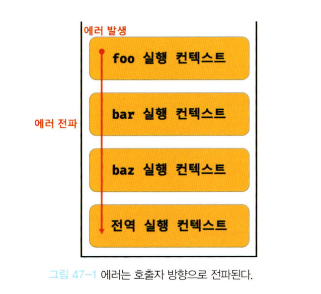

## 47.1 에러 처리의 필요성
- 에러는 언제나 발생할 수 있으며, 발생한 에러에 대처하지 않고 방치하면 프로그램은 강제 종료된다.
- try...catch 문
  ```js
  try {
    foo();
  } catch (error) {
    console.error('[에러 발생]', error);
  }
  ```
- 옵셔널 체이닝 연산자 ?.
  ```js
  const $button = document.querySelector('button'); // null
  $button?.classList.add('disabled');
  ```

## 47.2 try...catch...finally 문
- try...catch...finally 문은 3개의 코드 블록으로 구성된다.
- finally 문은 불필요하다면 생략이 가능하며, catch문도 생략 가능하지만 catch문이 없는 try문은 의미가 없으므로 생략하지 않는다.
  ```js
  try {
    // 실행할 코드(에러가 발생할 가능성이 있는 코드)
  } catch (err) {
    // try 코드 블록에서 에러가 발생하면 이 코드 블록의 코드가 실행된다.
    // err에는 try 코드 블록에서 발생한 Error 객체가 전달된다.
  } finally {
    // 에러 발생과 상관없이 반드시 한 번 실행된다.
  }
  ```

## 47.3 Error 객체
- Error 생성자 함수는 에러 객체를 생성한다.
- Error 생성자 함수에는 에러를 상세히 설명하는 에러 메시지를 인수로 전달할 수 있다.
  ```js
  const error = new Error('invalid');
  ```

  |생성자 함수|인스턴스|
  |---|---|
  |Error|일반적 에러 객체|
  |SyntaxError|자바스크립트 문법에 맞지 않는 문을 해석할 때 발생하는 에러 객체|
  |ReferenceError|참조할 수 없는 식별자를 참조했을 때 발생하는 에러 객체|
  |TypeError|피연산자 또는 인수의 데이터 타입이 유효하지 않을 때 발생하는 에러 객체|
  |RangeError|숫자값의 허용 범위를 벗어났을 때 발생하는 에러 객체|
  |URIError|encodeURI 또는 decodeURI 함수에 부적절한 인수를 전달했을 때 발생하는 에러 객체|
  |EvalError|eval 함수에서 발생하는 에러 객체|

  ```js
  1 @ 1; // SyntaxError: Invalid or unexpected token
  foo(); // ReferenceError: foo is not defined
  null.foo; // TypeError: Cannot read property 'foo' of null
  new Array(-l); // RangeError: Invalid array length 
  decodeUR1Component('%'); // URIError: URI malformed
  ```

## 47.4 throw문
- Error 생성자 함수로 에러 객체를 생성한다고 에러가 발생하는 것은 아니다. 즉, 에러 객체 생성과 에러 발생은 의미가 다르다.
- 에러를 발생시키려면 try 코드 블록에서 throw 문으로 에러 객체를 던져야 한다.
  ```js
  try {
    // 에러 객체를 생성한다고 에러가 발생하는 것은 아니다.
    new Error('something wrong');

    // 에러 객체를 던지면 catch 코드 블록이 실행되기 시작한다.
    throw new Error('something wrong');
  } catch (error) {
    console.log(error);
  }
  ```

## 47.5 에러의 전파
- 에러는 호출자 방향으로 전파된다. 즉, 콜 스택의 아래 방향(실행 중인 실행 컨텍스트가 푸시되기 직전에 푸시된 실행 컨텍스트 방향)으로 전파된다.
  ```js
  const foo = () => {
    throw Error('foo에서 발생한 에러');
  };

  const bar = () => {
    foo();
  };

  const baz = () => {
    bar();
  };

  try {
    baz();
  } catch (err) {
    console.error(err);
  }
  ```
- foo 함수가 throw한 에러는 다음과 같이 호출자에게 전파되어 전역에서 캐치된다.

- throw된 에러를 캐치하지 않으면 호출자 방향으로 전파된다.
- throw된 에러를 어디에서도 캐치하지 않으면 프로그램은 강제 종료된다.

