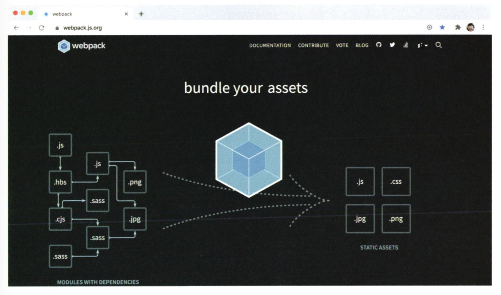
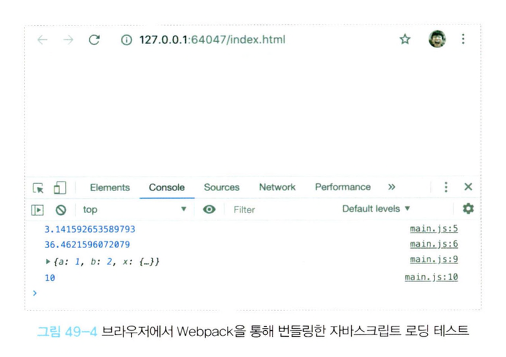

## 49.1 Babel
- Babel은 ES6+/ES.NEXT로 구현된 최신 사양의 소스코드를 IE 같은 구형 브라우저에서도 동작하는 ES5 사양의 소스코드로 변환(트랜스파일링)할 수 있다.

### 49.1.1 Babel 설치
- npm을 사용하여 Babel 설치
  ```bash
  # package.json 생성
  $ npm init -y

  # babel-core, babel-cli 설치
  $ npm install --save-dev @babel/core @babel/cli
  ```
- npm install은 언제나 최신 버전의 패키지를 설치한다. 버전을 지정하여 설치하고 싶다면 다음과 같이 입력하면 된다.
  ```
  $ npm install --save-dev @babel/core@7.10.3 @babel/cli@7.10.3
  ```

### 49.1.2 Babel 프리셋 설치와 babel.config.json 설정 파일 작성
- Babel을 사용하려면 @babel/preset-env를 설치해야 한다.
- @babel/preset-env는 함께 사용되어야 하는 Babel 플러그인을 모아 둔 것으로 Babel 프리셋이라고 부른다.
- Babel이 제공하는 공식 Babel 프리셋은 다음과 같다.
  - @babel/preset-env
  - @babel/preset-flow
  - @babel/preset-react
  - @babel/preset-typescript
- @babel/preset-env 설치
  ```
  $ npm install --save-dev @babel/preset-env
  ```
- 설치 후 프로젝트 루트 폴더에 babel.config.json 설정 파일을 생성하고 다음과 같이 작성한다. 지금 설치한 @babel/preset-env를 사용하겠다는 의미다.
  ```json
  {
    "presets": ["@babel/preset-env"]
  }
  ```

### 49.1.3 트랜스파일링
- Babel을 사용하여 ES6+/ES.NEXT 사양의 소스코드를 ES5 사양의 소스코드로 트랜스파일링할 수 있다.
- 트랜스파일링할 때마다 매번 Babel CLI 명령어를 입력하는 것은 번거로우므로 npm scripts에 Babel CLI 명령어를 등록하여 사용하는 것이 좋다.
- package.json 파일에 scripts를 추가
  ```json
  "script": {
    "build": "babel src/js -w -d dist/js"
  }
  ```
- 위 npm scripts의 build는 src/js 폴더(타깃 폴더)에 있는 모든 자바스크립트 파일들을 트랜스파일링한 후, 그 결과물을 dist/js 폴더에 저장한다.
  - w: 타깃 폴더에 있는 모든 자바스크립트 파일들의 변경을 감지하여 자동으로 트랜스파일한다. (-watch 옵션의 축약형)
  - d： 트랜스파일링된 결과물이 저장될 폴더를 지정한다. 만약 지정된 폴더가 존재하지 않으면 자동 생성한다 (--out-dir 옵션의 축약형)
- 프로젝트 루트 폴더에 src/js 폴더를 생성한 후 lib.js와 main.js 파일을 추가한다.
  ```js
  // src/js/lib.js
  export const pi = Math.PI;

  export function power(x, y) {
    return x ** y;
  }

  export class Foo {
    #private = 10; // 클래스 필드 정의

    foo() {
      const { a, b, ...x } = { ...{ a: 1, b: 2 }, c: 3, d: 4 };
      return { a, b, x };
    }

    bar() {
      return this.#private;
    }
  }
  ```
  ```js
  // src/js/main.js
  import { pi, power, Foo } from './lib';

  console.log(pi);
  console.log(power(pi, pi));

  const f = new Foo();
  console.log(f.foo());
  console.log(f.bar());
  ```
- 터미널에서 다음과 같이 명령어를 입력하여 트랜스파일링을 실행한다.
- 트랜스파일링에 성공하면 프로젝트 루트 폴더에 dist/js 폴더가 자동으로 생성되고, 트랜스파일링된 main.js와 lib.js가 저장된다.
  ```
  $ npm run build
  ```
- 트랜스파일링된 main.js 실행
  ```
  $ node dist/js/main
  3.141592653589793
  36.4621596072079
  { a: 1, b: 2, x: { c: 3, d: 4 } }
  10
  ```

### 49.1.5 브라우저에서 모듈 로딩 테스트
- 위에서 main.js를 실행한 결과 정상적으로 동작하는 것을 확인했다.
- 하지만 위 예제의 모듈 기능은 Node.js 환경에서 동작한 것이고 Babel이 모듈을 트렌스파일링한 것도 Node.js가 기본 지원하는 CommonJS 방식의 모듈 로딩 시스템에 따른 것이다.
- 브라우저에서 트랜스파일링된 결과(dist/js/main.js)를 그대로 실행하면 에러가 발생한다.
- Webpack을 통해 이러한 문제를 해결할 수 있다.

## 49.2 Webpack
- Webpack은 의존 관계에 있는 자바스크립트, CSS, 이미지 등의 리소스들을 하나(또는 여러 개)의 파일로 번들링하는 모듈 번들러다.
- Webpack을 사용하면 의존 모듈이 하나의 파일로 번들링되므로 별도의 모듈 로더가 필요 없다.
- 자바스크립트 파일을 하나로 번들링하므로 HTML 파일에서 script 태그로 여러 개의 자바스크립트 파일을 로드해야 하는 번거로움도 사라진다.


### 49.2.1 Webpack 설치
```
$ npm install --save-dev webpack webpack-cli
```

### 49.2. babel-loader 설치
- Webpack이 모듈을 번들링할 때 Babael을 사용하여 ES6+/ES.NEXT 사양의 소스코드를 ES5 사양의 소스코드로 트랜스파일링 하도록 bable-loader를 설치한다.
  ```
  $ npm install --save-dev babel-loader
  ```
- package.json 파일의 scripts를 다음과 같이 변경한다.
  ```js
  "scripts": {
    "build": "webpack -w"
  }
  ```

### 49.2.3 webpack.config.js 설정 파일 작성
- webpack.config.js는 Webpack이 실행될 때 참조하는 설정 파일이다.
- 프로젝트 루트 폴더에 webpack.config.js 파일을 생성하고 다음과 같이 작성한다. 
  ```js
  // webpack.config.js
  const path = require('path');

  module.exports = {
    // 진입 파일 (엔트리 포인트)
    entry: './src/js/main.js',

    // 번들 결과물 설정
    output: {
      path: path.resolve(__dirname, 'dist/js'), // 절대 경로로 지정
      filename: 'bundle.js', // 출력 파일 이름
    },

    // 로더 설정 (JS, CSS, 이미지 등 처리 방법)
    module: {
      rules: [
        {
          test: /\.js$/, // .js 파일
          include: [
            path.resolve(__dirname, 'src/js')
          ],
          exclude: /node_modules/,
          use: {
            loader: 'babel-loader', // ES6+ → ES5 변환
            options: {
              presets: ['@babel/preset-env'],
              //plugins: ['@babel/plugin-proposal-class-properties']
            }
          }
        }
      ]
    },

    devtool: 'source-map',

    // 모드 설정 (development, production, none)
    mode: 'development',
  };
  ```
- Webpack을 실행하여 트랜스파일링 및 번들링을 실행하면 dist/js 폴더에 bundle.js가 생성된다.
- 트랜스파일링은 Babel이 수행하고, 번들링은 Webpack이 수행한다.
  ```
  $ npm run build
  ```
- 루트 폴더에 index.html을 생성하여 다음과 같이 입력하고 브라우저에서 실행해보자.
  ```html
  <!DOCTYPE html>
  <html›>
  <body>
    <script src="./dist/js/bundle.js"></script>
  </body>
  </html>
  ```
  
- main.js, lib.js 모듈이 하나로 번들링된 bundle.js가 브라우저에서 문제 없이 실행된다.

### 49.2.4 babel-polyfill 설치
- ES6에서 추가된 Promise, Object.assign, Array.from 등은 Babel을 사용하여 ES5로 트랜스파일링해도 ES5 사양에 대체할 기능이 없기 때문에 트랜스파일링되지 못하고 그대로 남는다.
  ```js
  // src/js/main.js
  import { pi, power, Foo } from './lib';

  console.log(pi);
  console.log(power(pi, pi));

  const f = new Foo();
  console.log(f.foo());
  console.log(f.bar());

  // polyfill이 필요한 코드
  console.log(new Promise((resolve, reject) => {
    setTimeout(() => resolve(1), 100);
  }));

  // polyfill이 필요한 코드
  console.log(Object.assign({}. { x: 1 }, { y: 2 }));

  // polyfill이 필요한 코드
  console.log(Array.from([1, 2, 3], v => v + v));
  ```
- 따라서 IE 같은 구형 브라우저에서도 Promise, Object.assign, Array.from 등과 같은 객체나 메서드를 사용하기 위해서는 @babel/polyfill을 설치해야 한다.
- @babel/polyfill은 개발 환경에서만 사용하는 것이 아니라 실제 운영 환경에서도 사용해야 하기 때문에 개발용 의존성으로 설치하는 --save-dev 옵션을 지정하지 않는다.
  ```
  $ npm install @babel/polyfill
  ```
- ES6의 import를 사용하는 경우에는 진입점의 선두에서 폴리필을 로드하도록 한다.
  ```js
  // src/js/main.js
  import "@babel/polyfill";
  import { pi, power, Foo } from './lib';
  ...
  ```
- Webpack을 사용하는 경우에는 webpack.config.js 파일의 entry 배열에 폴리필을 추가한다.
  ```js
  // webpack.config.js
  const path = require('path');

  module.exports = {
    entry: ['@babel/polyfill', './src/js/main.js'],
  ...
  ```
- 위와 같이 수정하고 다시 Webpack을 실행한다. ($ npm run build)